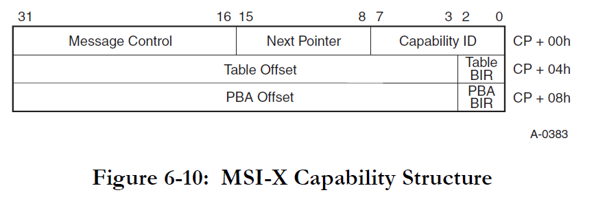

# Virtio-Pci

## Virtio-Pci介绍
### Pci Configuration Space
#### 简介
PCI有三个相互独立的物理地址空间：设备存储器地址空间、I/O地址空间和配置空间。配置空间是PCI所特有的一个物理空间。由于PCI支持设备即插即用，所以PCI设备不占用固定的内存地址空间或I/O地址空间，而是由操作系统决定其映射的基址。

系统加电时，BIOS检测PCI总线，确定所有连接在PCI总线上的设备以及它们的配置要求，并进行系统配置。所以，所有的PCI设备必须实现配置空间，从而能够实现参数的自动配置，实现真正的即插即用。


PCI总线规范定义的配置空间总长度为256个字节，配置信息按一定的顺序和大小依次存放。前64个字节的配置空间称为配置头，对于所有的设备都一样，配置头的主要功能是用来识别设备、定义主机访问PCI卡的方式（I/O访问或者存储器访问，还有中断信息）。其余的192个字节称为本地配置空间，主要定义卡上局部总线的特性、本地空间基地址及范围等。

每一个域具体对应的意思参见[pci spec v3.0](https://lekensteyn.nl/files/docs/PCI_SPEV_V3_0.pdf)第六章.其中重点关注BAR与Capability
- BAR(Base Address Reigster)
  - BAR用于定义PCI设备的内存或I/O空间的基地址。每个PCI设备可以有多个BAR，每个BAR可以指向不同的内存或I/O空间。BAR的主要作用是告诉操作系统或驱动程序设备的寄存器或内存映射的位置。
- Capability
  - Capability是PCI设备的一种扩展机制，用于支持额外的功能和特性。每个Capability都有一个唯一的ID和一个指向下一个Capability的指针。常见的Capability包括MSI（Message Signaled Interrupts）、MSI-X、PCI Express等

#### 访问方式
访问PCI配置空间可通过两个访问寄存器，CONFIG_ADDRESS寄存器(对应0xcf8端口)和CONFIG_DATA寄存器(对应0xcfc端口)。这两个端口是32位端口。
每个PCI设备可应用三个信息进行定位，即Bus Number、Device Number和Function Number(bdf)。

每次要访问PCI配置空间时，先设置CONFIG_ADDRESS寄存器的bdf与需要读取数据的偏移量(即Register Number)，这时CONFIG_DATA存储器的内容就对应着该PCI配置空间中的相应的寄存器,再从CONFIG_DATA寄存器读取相应的内容即可.

## 代码详解
### pci设备的虚拟化
- crates/hypercraft/src/arch/x86_64/mod.rs中的VM结构体定义了属于VM的设备,pci设备属于VM的设备,将在device的初始化函数中进行初始化
```rust
/// VM define.
pub struct VM<H: HyperCraftHal, PD: PerCpuDevices<H>, VD: PerVmDevices<H>, G: GuestPageTableTrait> {
    vcpus: VmCpus<H, PD>,
    vcpu_bond: BitSet,
    device: VD,	// pci device belongs to this field
    vm_id: u32,
    /// EPT
    pub ept: Arc<G>,
}
```
- modules/axvm/src/device/x86_64/mod.rs中定义了PerVmDevice的初始化.
```rust
pub struct DeviceList<H: HyperCraftHal, B: BarAllocTrait> {
    port_io_devices: Vec<Arc<Mutex<dyn PioOps>>>,
    memory_io_devices: Vec<Arc<Mutex<dyn MmioOps>>>,
    msr_devices: Vec<Arc<Mutex<dyn VirtMsrOps>>>,
    pci_devices: Option<Arc<Mutex<PciHost<B>>>>,
    vm_id: Option<u32>,
    vcpu_id: Option<u32>,
    marker: core::marker::PhantomData<H>,
}

impl<H: HyperCraftHal, B: BarAllocTrait + 'static> PerVmDevices<H> for NimbosVmDevices<H, B> {
    fn new(vm_id: u32) -> HyperResult<Self> {
        let mut devices = DeviceList::new(None, Some(vm_id));
        // init pci device
        devices.init_pci_host();
        devices.add_port_io_device(devices.pci_devices.clone().unwrap());
        // This is just for test.
        // devices.add_pci_device(String::from("pcitest"), Arc::new(AtomicU16::new(0)), 0x18)?;

        // Create a virtio dummy device
        let virtio_device_dummy = DummyVirtioDevice::new(VIRTIO_TYPE_BLOCK, 1, 4);
        devices.add_virtio_pci_device(
            String::from("virtio_blk_dummy"),
            0x18,
            Arc::new(Mutex::new(virtio_device_dummy)),
            false,
        )?;

        Ok(Self {
            marker: PhantomData,
            devices,
        })
    }
  ...
}
```
- modules/axvm/src/device/x86_64/mod.rs中定义了初始化虚拟化pci总线与添加pci设备的函数,pci内部细节见后文
```rust
	fn init_pci_host(&mut self) {
        if let Some(vm_id) = self.vm_id {
            let pci_host = PciHost::new(Some(Arc::new(super::virtio::VirtioMsiIrqManager {
                vm_id: self.vm_id.expect("None vm for pci host"),
            })));
            self.pci_devices = Some(Arc::new(Mutex::new(pci_host)));
        } else {
            panic!("this is not vm devicelist. vm_id is None");
        }
    }
    
        fn add_pci_device(
        &mut self,
        name: String,
        dev_id: Arc<AtomicU16>,
        devfn: u8,
    ) -> HyperResult<()> {
        let mut pci_host = self.pci_devices.clone().unwrap();
        let pci_bus = pci_host.lock().root_bus.clone();
        let parent_bus = Arc::downgrade(&pci_bus);
        let mut pcidev = DummyPciDevice::<B>::new(name, devfn, parent_bus, 0x1010);
        pcidev.realize()
    }

    // virtio pci devfn: 0x18 bus: 0x0.
    fn add_virtio_pci_device(
        &mut self,
        name: String,
        devfn: u8,
        device: Arc<Mutex<dyn VirtioDevice>>,
        multi_func: bool,
    ) -> HyperResult<()> {
        let mut pci_host = self.pci_devices.clone().unwrap();
        let pci_bus = pci_host.lock().root_bus.clone();
        let parent_bus = Arc::downgrade(&pci_bus);
        let mut pcidev = VirtioPciDevice::<B>::new(name, devfn, device, parent_bus, multi_func);
        pcidev.realize()
    }
```
- pciHost作为一个io设备(config_address对应0xcf8,config_data对应0xcfc),在crates/pci/src/host.rs中实现了PioOps.当guest访问0xcf8与0xcfc端口时,会调用PciHost对应的write或者read函数进行对应操作,从而实现对pci设备的模拟.
```rust
impl<B: BarAllocTrait> PioOps for PciHost<B> {
    fn port_range(&self) -> Range<u16> {
        PCI_CFG_ADDR_PORT.start..PCI_CFG_DATA_PORT.end
    }

    fn read(&mut self, port: u16, access_size: u8) -> HyperResult<u32> {
        let mut data = [0xffu8; 4]; // max access size is 4
        let cloned_hb = self.clone();
        if PCI_CFG_ADDR_PORT.contains(&port) {
            // Read configuration address register.
            if port==0xcf8 && self.check_type1==2 {
                self.check_type1 = 0;
                return Ok(0x8000_0000);
            }
            else {
                // also deal with tmp = inl(0xCF8); in check type
                le_write_u32(&mut data[..], 0, cloned_hb.config_addr).unwrap();
            }
        } else {
            // Read configuration data register.
            if access_size > 4 || cloned_hb.config_addr & CONFIG_ADDRESS_ENABLE_MASK == 0 {
                return Err(HyperError::InValidPioRead);
            }
            let mut offset: u32 = (cloned_hb.config_addr & !CONFIG_ADDRESS_ENABLE_MASK)
                + (port - PCI_CFG_DATA_PORT.start) as u32;
            let bus_num = ((offset >> PIO_BUS_SHIFT) & CONFIG_BUS_MASK) as u8;
            let devfn = ((offset >> PIO_DEVFN_SHIFT) & CONFIG_DEVFN_MASK) as u8;
            match cloned_hb.find_device(bus_num, devfn) {
                Some(dev) => {
                    offset &= PIO_OFFSET_MASK;
                    dev.lock().read_config(offset as usize, &mut data[..]);
                }
                None => {
                    for d in data.iter_mut() {
                        *d = 0xff;
                    }
                }
            }
        }
        match access_size {
            1 => Ok(u32::from_le_bytes([data[0], 0, 0, 0])),
            2 => Ok(u32::from_le_bytes([data[0], data[1], 0, 0])),
            4 => Ok(u32::from_le_bytes(data)),
            _ => Err(HyperError::InValidPioRead),
        }
    }

    fn write(&mut self, port: u16, access_size: u8, value: u32) -> HyperResult {
        if PCI_CFG_ADDR_PORT.contains(&port) {
            // Write configuration address register.
            // deal with pci_check_type1 in linux
            if port == 0xcfb && access_size == 1 {
                self.check_type1 = 1;
               // do nothing for read from 0xcf8; 1: outb(0x01, 0xCFB); then will tmp = inl(0xCF8);
            }
            else {
                if self.check_type1==1 {
                    self.check_type1 = 2;
                }else {
                    // save bdf for next read/write
                    self.config_addr = le_read_u32(&value.to_le_bytes(), 0).unwrap();
                }
            }
        } else {
            // Write configuration data register.
            if access_size > 4 || self.config_addr & CONFIG_ADDRESS_ENABLE_MASK == 0 {
                return Err(HyperError::InValidPioWrite);
            }

            let mut offset: u32 = (self.config_addr & !CONFIG_ADDRESS_ENABLE_MASK)
                + (port - PCI_CFG_DATA_PORT.start) as u32;
            let bus_num = ((offset >> PIO_BUS_SHIFT) & CONFIG_BUS_MASK) as u8;
            let devfn = ((offset >> PIO_DEVFN_SHIFT) & CONFIG_DEVFN_MASK) as u8;
            
            if let Some(dev) = self.find_device(bus_num, devfn) {
                offset &= PIO_OFFSET_MASK;
                let value_bytes = value.to_le_bytes();
                let value_byte: &[u8] = match access_size {
                    1 => &value_bytes[0..1],
                    2 => &value_bytes[0..2],
                    4 => &value_bytes[0..4],
                    _ => return Err(HyperError::InValidPioWrite),
                };
                dev.lock().write_config(offset as usize, value_byte);
            }
        }
        Ok(())
    }
}
```
### pci设备实现细节
#### PciHost
- 作为vm总的pci设备,定义在crates/pci/src/host.rs
```rust
#[derive(Clone)]
pub struct PciHost<B: BarAllocTrait> {
	// pci设备总线
    pub root_bus: Arc<Mutex<PciBus<B>>>,
    #[cfg(target_arch = "x86_64")]
    // x86中用于保存当前需要读写的pci设备,具体会在PioOps实现中使用
    config_addr: u32,
    check_type1: usize,
}

impl<B: BarAllocTrait> PciHost<B> {
    /// Construct PCI/PCIe host.
    pub fn new(msi_irq_manager: Option<Arc<dyn MsiIrqManager>>) -> Self {
        let root_bus = PciBus::new(String::from("pcie.0"), msi_irq_manager);
        PciHost {
            root_bus: Arc::new(Mutex::new(root_bus)),
            #[cfg(target_arch = "x86_64")]
            config_addr: 0,
            check_type1: 0,
        }
    }

    pub fn find_device(&self, bus_num: u8, devfn: u8) -> Option<Arc<Mutex<dyn PciDevOps<B>>>> {
        let locked_root_bus = self.root_bus.lock();
        if bus_num == 0 {
            return locked_root_bus.get_device(0, devfn);
        }
        for bus in &locked_root_bus.child_buses {
            if let Some(b) = PciBus::find_bus_by_num(bus, bus_num) {
                return b.lock().get_device(bus_num, devfn);
            }
        }
        None
    }
}
```
---
####  PciBus
- pci总线,定义在crates/pci/src/bus.rs
```rust
pub struct PciBus<B: BarAllocTrait> {
    /// Bus name
    pub name: String,
    /// Devices attached to the bus.
    pub devices: BTreeMap<u8, Arc<Mutex<dyn PciDevOps<B>>>>,
    /// Child buses of the bus.
    pub child_buses: Vec<Arc<Mutex<PciBus<B>>>>,
    /// Pci bridge which the bus originates from.
    pub parent_bridge: Option<Weak<Mutex<dyn PciDevOps<B>>>>,
    /// MSI interrupt manager. 用于发送msi/msix中断,用于通知pci设备
    pub msi_irq_manager: Option<Arc<dyn MsiIrqManager>>,
}
```
---
#### PciDevOps(trait)
- 实现了PciDevOps trait的结构体都可当作pci设备使用,定义在crates/pci/src/lib.rs
```rust
#[derive(Clone)]
// PciDevBase代表所有Pci设备共同具有的一些属性,这是实现pci设备必须包含的一个结构,其中最重要的是PciConfig
pub struct PciDevBase<B: BarAllocTrait> {
    /// Name of this device
    pub id: String,
    /// Pci config space.
    pub config: PciConfig<B>,
    /// Devfn.
    pub devfn: u8,
    /// Primary Bus.
    pub parent_bus: Weak<Mutex<PciBus<B>>>,
}
```
- PciDevOps需要重点关注read_config与write_config函数,这两个函数是与pci设备进行交互的关键,会在PciHost实现PioOps的read和write中被调用.
```rust
pub trait PciDevOps<B: BarAllocTrait>: Send + AsAny {
    /// Get device name.
    fn name(&self) -> String;

    /// Get base property of pci device.
    fn pci_base(&self) -> &PciDevBase<B>;

    /// Get mutable base property of pci device.
    fn pci_base_mut(&mut self) -> &mut PciDevBase<B>;

    /// Init writable bit mask.
    fn init_write_mask(&mut self, is_bridge: bool) -> Result<()> {
        self.pci_base_mut().config.init_common_write_mask()?;
        if is_bridge {
            self.pci_base_mut().config.init_bridge_write_mask()?;
        }

        Ok(())
    }

    /// Init write-and-clear bit mask.
    fn init_write_clear_mask(&mut self, is_bridge: bool) -> Result<()> {
        self.pci_base_mut().config.init_common_write_clear_mask()?;
        if is_bridge {
            self.pci_base_mut().config.init_bridge_write_clear_mask()?;
        }

        Ok(())
    }

    /// Realize PCI/PCIe device.
    fn realize(self) -> Result<()>;

    /// Unrealize PCI/PCIe device.
    fn unrealize(&mut self) -> Result<()> {
        panic!("Unrealize of the pci device is not implemented");
    }

    /// Configuration space read.
    ///
    /// # Arguments
    ///
    /// * `offset` - Offset in configuration space.
    /// * `data` - Data buffer for reading.
    fn read_config(&mut self, offset: usize, data: &mut [u8]) {
        self.pci_base_mut().config.read(offset, data);
    }

    /// Configuration space write.
    ///
    /// # Arguments
    ///
    /// * `offset` - Offset in configuration space.
    /// * `data` - Data to write.
    fn write_config(&mut self, offset: usize, data: &[u8]);

    /// Set device id to send MSI/MSI-X.
    ///
    /// # Arguments
    ///
    /// * `bus_num` - Bus number.
    /// * `devfn` - Slot number << 8 | Function number.
    ///
    /// # Returns
    ///
    /// Device id to send MSI/MSI-X.
    fn set_dev_id(&self, bus_num: u8, devfn: u8) -> u16 {
        let bus_shift: u16 = 8;
        ((bus_num as u16) << bus_shift) | (devfn as u16)
    }

    /// Reset device
    fn reset(&mut self, _reset_child_device: bool) -> Result<()> {
        Ok(())
    }

    /// Get the path of the PCI bus where the device resides.
    fn get_parent_dev_path(&self, parent_bus: Arc<Mutex<PciBus<B>>>) -> String {
        let locked_parent_bus = parent_bus.lock();
        let parent_dev_path = if locked_parent_bus.name.eq("pcie.0") {
            String::from("/pci@ffffffffffffffff")
        } else {
            // This else branch will not be executed currently,
            // which is mainly to be compatible with new PCI bridge devices.
            // unwrap is safe because pci bus under root port will not return null.
            locked_parent_bus
                .parent_bridge
                .as_ref()
                .unwrap()
                .upgrade()
                .unwrap()
                .lock()
                .get_dev_path()
                .unwrap()
        };
        parent_dev_path
    }

    /// Fill the device path according to parent device path and device function.
    fn populate_dev_path(&self, parent_dev_path: String, devfn: u8, dev_type: &str) -> String {
        let slot = pci_slot(devfn);
        let function = pci_func(devfn);

        let slot_function = if function != 0 {
            format!("{:x},{:x}", slot, function)
        } else {
            format!("{:x}", slot)
        };

        format!("{}{}{}", parent_dev_path, dev_type, slot_function)
    }

    /// Get firmware device path.
    fn get_dev_path(&self) -> Option<String> {
        None
    }

    fn change_irq_level(&self, _irq_pin: u32, _level: i8) -> Result<()> {
        Ok(())
    }

    // fn get_intx_state(&self) -> Option<Arc<Mutex<PciIntxState>>> {
    //     None
    // }

    fn get_msi_irq_manager(&self) -> Option<Arc<dyn MsiIrqManager>> {
        None
    }
}
```
---
#### PciConfig
- Pci的configuration space.其中包含了前文所说的那256 bytes,定义在crates/pci/src/config.rs
```rust
/// Configuration space of PCI/PCIe device.
#[derive(Clone)]
pub struct PciConfig<B: BarAllocTrait> {
	// 对应的256 bytes的真实数据
    /// Configuration space data.
    pub config: Vec<u8>,
    // 256 bytes对应的write mask
    /// Mask of writable bits.
    pub write_mask: Vec<u8>,
    /// Mask of bits which are cleared when written.
    pub write_clear_mask: Vec<u8>,
    // 当前pci设备映射的内存/port区域的信息
    /// BARs.
    pub bars: Vec<Bar>,
    // 因为capability像一个一个链表连在一起,用于插入capability时候进行寻址
    /// Base offset of the last PCI standard capability.
    pub last_cap_end: u16,
    /// Base offset of the last PCIe extended capability.
    pub last_ext_cap_offset: u16,
    /// End offset of the last PCIe extended capability.
    pub last_ext_cap_end: u16,
    // 当前pci设备的msix中断信息
    /// MSI-X information.
    pub msix: Option<Arc<Mutex<Msix>>>,
    /// Phantom data.
    _phantom: PhantomData<B>,
}
```
  - PciConfig中需要重点关注的函数:
    - read: 根据offset读取pci configuration space的内容,在实现PciDevOps trait中的read_config中会被调用
    ```rust
      	  /// Common reading from configuration space.
          ///
          /// # Arguments
          ///
          /// * `offset` - Offset in the configuration space from which to read.
          /// * `data` - Buffer to put read data.
          pub fn read(&mut self, offset: usize, buf: &mut [u8]) {
              if let Err(err) = self.validate_config_boundary(offset, buf) {
                  warn!("invalid read: {:?}", err);
                  return;
              }
      
              let size = buf.len();
              debug!(
                  "read offset: {} content:: {:?}",
                  offset,
                  &self.config[offset..(offset + size)] as &[u8]
              );
      
              buf[..].copy_from_slice(&self.config[offset..(offset + size)]);
          }
    ```
    - write: 根据offset写pci configuration space的内容,在实现PciDevOps trait中的write_config中会被调用.区别于read,直接读,写可能还会涉及到其他更新PciConfig中msix与bar地址的操作.
    ```rust
    /// # Arguments
    ///
    /// * `offset` - Offset in the configuration space from which to write.
    /// * `data` - Data to write.
    /// * `dev_id` - Device id to send MSI/MSI-X.
    pub fn write(&mut self, mut offset: usize, data: &[u8], dev_id: u16) {
        debug!("write offset: {} data: {:?}", offset, data);
        if let Err(err) = self.validate_config_boundary(offset, data) {
            error!("invalid write: {:?}", err);
            return;
        }
    
        // write data to config space.
        let cloned_data = data.to_vec();
        let old_offset = offset;
        for data in &cloned_data {
            self.config[offset] = (self.config[offset] & (!self.write_mask[offset]))
                | (data & self.write_mask[offset]);
            self.config[offset] &= !(data & self.write_clear_mask[offset]);
            offset += 1;
        }
    
        // Expansion ROM Base Address: 0x30-0x33 for endpoint, 0x38-0x3b for bridge.
        let (bar_num, rom_addr) = match self.config[HEADER_TYPE as usize] & HEADER_TYPE_BRIDGE {
            HEADER_TYPE_BRIDGE => (BAR_NUM_MAX_FOR_BRIDGE as usize, ROM_ADDRESS_BRIDGE),
            _ => (BAR_NUM_MAX_FOR_ENDPOINT as usize, ROM_ADDRESS_ENDPOINT),
        };
    
        let size = data.len();
        // SAFETY: checked in "validate_config_boundary".
        // check if command bit or bar region or expansion rom base addr changed, then update it.
        let cmd_overlap = ranges_overlap(old_offset, size, COMMAND as usize, 1).unwrap();
        if cmd_overlap
            || ranges_overlap(old_offset, size, BAR_0 as usize, REG_SIZE * bar_num).unwrap()
            || ranges_overlap(old_offset, size, rom_addr, 4).unwrap()
        {
            if let Err(e) = self.update_bar_mapping(false) {
                error!("{:?}", e);
            }
        }
    
        if let Some(msix) = &mut self.msix {
            msix.lock()
                .write_config(&self.config, dev_id, old_offset, data);
        }
    }
    ```
    - register_bar: 注册pci设备对应的bar.需要确定注册的bar的区域类型(pio/mmio);确定bar的id,一般而言pci可以有6个bar;需要确定访问到这块bar时对应的read/write操作,具体细节参考[bar](#bar)
    ```rust
    /// Register a bar in PciConfig::bars.
    ///
    /// # Arguments
    ///
    /// * `id` - Index of the BAR.
    /// * `ops` - RegionOps mapped for the BAR.
    /// * `region_type` - Region type of the BAR.
    /// * `prefetchable` - Indicate whether the BAR is prefetchable or not.
    /// * `size` - Size of the BAR.
    pub fn register_bar(
        &mut self,
        id: usize,
        ops: Option<RegionOps>,
        region_type: RegionType,
        prefetchable: bool,
        size: u64,
    ) -> Result<()> {
        self.validate_bar_id(id)?;
        self.validate_bar_size(region_type, size)?;
        let offset: usize = BAR_0 as usize + id * REG_SIZE;
        let size = if region_type == RegionType::Io {
            size
        } else {
            // align up to 4KB
            (size + 0xfff) & !0xfff
        };
        match region_type {
            RegionType::Io => {
                let write_mask = !(size - 1) as u32;
                le_write_u32(&mut self.write_mask, offset, write_mask).unwrap();
                self.config[offset] = BAR_IO_SPACE;
            }
            RegionType::Mem32Bit => {
                let write_mask = !(size - 1) as u32;
                le_write_u32(&mut self.write_mask, offset, write_mask).unwrap();
            }
            RegionType::Mem64Bit => {
                let write_mask = !(size - 1);
                le_write_u64(&mut self.write_mask, offset, write_mask).unwrap();
                self.config[offset] = BAR_MEM_64BIT;
            }
        }
        if prefetchable {
            self.config[offset] |= BAR_PREFETCH;
        }
        debug!("this is register bar\n");
        // let mut allocator = PCI_BAR_ALLOCATOR.lock();
        // let addr = allocator.alloc(region_type, size)?;
        // let actual_addr = B::alloc(region_type, size)?;
    
        // Hard code, delete it!!!
        let addr = match region_type {
            RegionType::Io => BAR_SPACE_UNMAPPED,
            RegionType::Mem32Bit => 0xfebd5000,
            RegionType::Mem64Bit => 0xfe000000,
        };
    
        self.bars[id].ops = ops;
        self.bars[id].region_type = region_type;
        // self.bars[id].address = BAR_SPACE_UNMAPPED;
        self.bars[id].address = addr;
        self.bars[id].actual_address = addr;
        self.bars[id].size = size;
    
        // Write the front part of addr into self.config[offset + 4] to self.bars[id].actual_address = actual_addr;self.config[offset + 31]
        let length = match region_type {
            RegionType::Io => BAR_SPACE_UNMAPPED,
            RegionType::Mem32Bit => 4,
            RegionType::Mem64Bit => 8,
        } as usize;
        for i in 0..length {
            if i == 0 {
                self.config[offset + i] |= (addr as u8) & !0xf;
            } else {
                self.config[offset + i] |= (addr >> (i * 8)) as u8;
            }
        }
        let get_addr = self.get_bar_address(id);
        debug!(
            "after register content:: {:?} addr:{:#x}",
            &self.config[offset..(offset + 4)] as &[u8],
            get_addr
        );
        Ok(())
    }
    ```
    - update_bar_mapping: 当guest更新bar地址的时候,同步更新到PciConfig结构中,以便后续guest访问新地址时能进行对应的操作
    ```rust
    /// Update bar space mapping once the base address is updated by the guest.
    pub fn update_bar_mapping(&mut self, is_empty: bool) -> Result<()> {
        for id in 0..self.bars.len() {
            if self.bars[id].size == 0 {
                continue;
            }
    
            let new_addr: u64 = self.get_bar_address(id);
            debug!(
                "[update_bar_mapping] id: {}, addr:{:#x} new_addr: {:#x}",
                id, self.bars[id].address, new_addr
            );
            // if the bar is not updated, just skip it.
            if self.bars[id].address == new_addr {
                debug!("bar {} is not updated", id);
                continue;
            }
    
            // first unmmap origin bar region
            if self.bars[id].address != BAR_SPACE_UNMAPPED {
                // Invalid the bar region
                {
                    let mut allocator = PCI_BAR_ALLOCATOR.lock();
                    allocator.dealloc(self.bars[id].region_type, self.bars[id].address);
                }
                self.bars[id].address = BAR_SPACE_UNMAPPED;
            }
    
            if is_empty {
                return Ok(());
            }
    
            // map new region
            if new_addr != BAR_SPACE_UNMAPPED {
                self.bars[id].address = new_addr;
                // let mut allocator = PCI_BAR_ALLOCATOR.lock();
                // allocator.alloc_addr(self.bars[id].region_type, self.bars[id].size, new_addr)?;
                // Write the front part of addr into self.config[offset + 4] to self.config[offset + 31]
                let offset = BAR_0 as usize + id as usize * REG_SIZE;
                for i in 0..4 {
                    if i == 0 {
                        self.config[offset + i] |= (new_addr as u8) & !0xf;
                    } else {
                        self.config[offset + i] |= (new_addr >> (i * 8)) as u8;
                    }
                }
            }
        }
        Ok(())
    }
    ```
    - find_pio/find_mmio: 找到对应的mmio/pio bar,以便能够获取到这片bar区域对应的操作,用于处理访问该片区域触发的vmexit
    ```rust
    /// Find a PIO BAR by Port.
    pub fn find_pio(&self, port: u16) -> Option<&Bar> {
        self.bars
            .iter()
            .find(|bar| bar.region_type == RegionType::Io && bar.port_range().contains(&port))
    }
    
    /// Find a MMIO BAR by Address.
    pub fn find_mmio(&self, addr: u64) -> Option<&Bar> {
        self.bars.iter().find(|bar| {
            bar.region_type == RegionType::Mem64Bit
                || bar.region_type == RegionType::Mem32Bit && bar.mmio_range().contains(&addr)
        })
    }
    ```
    - add_pci_cap: 为该pci设备添加一个新的capability
    ```rust
    /// Add a pci standard capability in the configuration space.
    ///
    /// # Arguments
    ///
    /// * `id` - Capability ID.
    /// * `size` - Size of the capability.
    pub fn add_pci_cap(&mut self, id: u8, size: usize) -> Result<usize> {
        // offset is the base offset of the next capability.
        let offset = self.last_cap_end as usize;
        if offset + size > PCI_CONFIG_SPACE_SIZE {
            return Err(HyperError::PciError(PciError::AddPciCap(id, size)));
        }
        // every time add the new capability to the head of the capability list.
        // [0:7]: id
        self.config[offset] = id;
        // [8:15]: next capability offset. the first saved capablilty(address by 0x34)
        self.config[offset + NEXT_CAP_OFFSET as usize] = self.config[CAP_LIST as usize];
        // update the head of the capability list.
        self.config[CAP_LIST as usize] = offset as u8;
        // [4]: Capabilities List. This optional read-only bit indicates whether or not this device implements the pointer for a New Capabilities linked list at offset 34h.
        self.config[STATUS as usize] |= STATUS_CAP_LIST as u8;
    
        // caculate how many regs this capability will occupy.
        let regs_num = if size % REG_SIZE == 0 {
            size / REG_SIZE
        } else {
            size / REG_SIZE + 1
        };
        // update write_mask and mov capability to next offset.
        for _ in 0..regs_num {
            le_write_u32(&mut self.write_mask, self.last_cap_end as usize, 0)?;
            self.last_cap_end += REG_SIZE as u16;
        }
        // return this capability offset.
        Ok(offset)
    }
    ```
---
####  <a id="bar">Bar</a>
- Pci设备的Base Address Register,该结构体用于处理pio/mmio导致的vmexit时对应区域应该调用什么操作.定义在crates/pci/src/config.rs
```rust
/// Registered bar.
#[derive(Clone)]
pub struct Bar {
    region_type: RegionType,
    // guest中对应的地址,gpa
    address: u64,
    // use host virtual address to get data
    actual_address: u64,
    pub size: u64,
    ops: Option<RegionOps>,
}
```
  - 由于bar对应的是一块mmio/pio区域,在触发vmexit的时候可以将其作为一个实现了PioOps/MmioOps的设备使用,所以为Bar实现了PioOps与MmioOps
  ```rust
  impl PioOps for Bar {
    fn port_range(&self) -> core::ops::Range<u16> {
        self.address as u16..(self.address + self.size) as u16
    }

    fn read(&mut self, port: u16, access_size: u8) -> HyperResult<u32> {
        let offset = port - self.address as u16;
        let read_func = &*self.ops.as_ref().unwrap().read;
        let ret = read_func(offset as u64, access_size)?;
        Ok(ret as u32)
    }

    fn write(&mut self, port: u16, access_size: u8, value: u32) -> HyperResult {
        let offset = port - self.address as u16;
        let write_func = &*self.ops.as_ref().unwrap().write;
        let value_bytes = value.to_le_bytes();
        let value_byte: &[u8] = match access_size {
            1 => &value_bytes[0..1],
            2 => &value_bytes[0..2],
            4 => &value_bytes[0..4],
            _ => return Err(HyperError::InValidPioWrite),
        };
        write_func(offset as u64, access_size, value_byte)
    }
}

impl MmioOps for Bar {
    fn mmio_range(&self) -> core::ops::Range<u64> {
        self.address..self.address + self.size
    }

    fn read(&mut self, addr: u64, access_size: u8) -> hypercraft::HyperResult<u64> {
        // debug!("this is mmio read addr:{:#x}", addr);
        if self.ops.is_some() {
            let offset = addr - self.address;
            let read_func = &*self.ops.as_ref().unwrap().read;
            let ret = read_func(offset, access_size)?;
            Ok(ret)
        } else {
            let offset = addr - self.address;
            let actual_addr = self.actual_address + offset;
            // debug!(
            //     "read this is ops is none offset:{:#x} actual_addr:{:#x}",
            //     offset, actual_addr
            // );
            let data = match access_size {
                1 => unsafe { read(actual_addr as *const u8) as u64 },
                2 => unsafe { read(actual_addr as *const u16) as u64 },
                4 => unsafe { read(actual_addr as *const u32) as u64 },
                8 => unsafe { read(actual_addr as *const u64) },
                _ => return Err(HyperError::InValidMmioRead),
            };
            // debug!("read data:{:#x}", data);
            Ok(data)
        }
    }

    fn write(&mut self, addr: u64, access_size: u8, value: u64) -> hypercraft::HyperResult {
        debug!("this is mmio write addr:{:#x} value:{:#x}", addr, value);
        if self.ops.is_some() {
            let offset = addr - self.address;
            let write_func = &*self.ops.as_ref().unwrap().write;
            let value_bytes = value.to_le_bytes();
            // debug!("value_bytes: {:?}", value_bytes);
            let value_byte: &[u8] = match access_size {
                1 => &value_bytes[0..1],
                2 => &value_bytes[0..2],
                4 => &value_bytes[0..4],
                8 => &value_bytes[0..8],
                _ => return Err(HyperError::InValidMmioWrite),
            };
            write_func(offset, access_size, value_byte)
        } else {
            let offset = addr - self.address;
            let actual_addr = self.actual_address + offset;
            // debug!("write this is ops is none offset:{:#x}", offset);
            match access_size {
                1 => unsafe { write(actual_addr as *mut u8, value as u8) },
                2 => unsafe { write(actual_addr as *mut u16, value as u16) },
                4 => unsafe { write(actual_addr as *mut u32, value as u32) },
                8 => unsafe { write(actual_addr as *mut u64, value) },
                _ => return Err(HyperError::InValidMmioWrite),
            };
            Ok(())
        }
    }
}
  ```
  - 在实现Bar的PioOps与MmioOps的trait时,调用了其RegionOps.RegionOps定义在crates/hypercraft/src/hal.rs中,在注册bar的时候会传入对应的read/write函数进行初始化
  ```rust
/// Read data from Region to argument `data`,
/// return `true` if read successfully, or return `false`.
///
/// # Arguments
///
/// * `offset` - Base address offset.
/// * `access_size` - Access size.
type ReadFn = alloc::sync::Arc<dyn Fn(u64, u8) -> HyperResult<u64> + Send + Sync>;

/// Write `data` to memory,
/// return `true` if write successfully, or return `false`.
///
/// # Arguments
///
/// * `offset` - Base address offset
/// * `access_size` - Access size.
/// * `data` - A u8-type array.
type WriteFn = alloc::sync::Arc<dyn Fn(u64, u8, &[u8]) -> HyperResult + Send + Sync>;

/// Provide Some operations of `Region`, mainly used by Vm's devices.
#[derive(Clone)]
pub struct RegionOps {
    /// Read data from Region to argument `data`,
    pub read: ReadFn,
    /// Write `data` to memory,
    pub write: WriteFn,
}
  ```
- 注册bar的例子,以msix为例,因为msix需要bar去存储中断的相关信息,相关内容定义在crates/pci/src/msix.rs
```rust
...
	Msix::generate_region_ops(msix.clone(), dev_id).unwrap();
    config.register_bar(
        bar_id,
        Some(msix_region_ops),
        RegionType::Mem32Bit,
        false,
        bar_size,
    )?;
...
	fn generate_region_ops(
        msix: Arc<Mutex<Self>>,
        dev_id: Arc<AtomicU16>,
    ) -> HyperResult<RegionOps> {
        // let locked_msix = msix.lock();
        // let table_size = locked_msix.table.len() as u64;
        // let pba_size = locked_msix.pba.len() as u64;

        let cloned_msix = msix.clone();
        let read = move |offset: u64, access_size: u8| -> HyperResult<u64> {
            let mut data = [0u8; 8];
            let access_offset = offset as usize + access_size as usize;
            if access_offset > cloned_msix.lock().table.len() {
                if access_offset > cloned_msix.lock().table.len() + cloned_msix.lock().pba.len() {
                    error!(
                        "Fail to read msix table and pba, illegal data length {}, offset {}",
                        access_size, offset
                    );
                    return Err(HyperError::OutOfRange);
                }
                // deal with pba read
                let offset = offset as usize;
                data[0..access_size as usize].copy_from_slice(
                    &cloned_msix.lock().pba[offset..(offset + access_size as usize)],
                );
                return Ok(u64::from_le_bytes(data));
            }
            // msix table read
            data[0..access_size as usize].copy_from_slice(
                &cloned_msix.lock().table
                    [offset as usize..(offset as usize + access_size as usize)],
            );
            Ok(u64::from_le_bytes(data))
        };

        let cloned_msix = msix.clone();
        let write = move |offset: u64, access_size: u8, data: &[u8]| -> HyperResult {
            let access_offset = offset as usize + access_size as usize;
            if access_offset > cloned_msix.lock().table.len() {
                if access_offset > cloned_msix.lock().table.len() + cloned_msix.lock().pba.len() {
                    error!(
                        "It's forbidden to write out of the msix table and pba (size: {}), with offset of {} and size of {}",
                        cloned_msix.lock().table.len(),
                        offset,
                        data.len()
                    );
                    return Err(HyperError::OutOfRange);
                }
                // deal with pba read
                return Ok(());
            }
            let mut locked_msix = cloned_msix.lock();
            let vector: u16 = offset as u16 / MSIX_TABLE_ENTRY_SIZE;
            let was_masked: bool = locked_msix.is_vector_masked(vector);
            let offset = offset as usize;
            locked_msix.table[offset..(offset + data.len())].copy_from_slice(data);

            let is_masked: bool = locked_msix.is_vector_masked(vector);

            // Clear the pending vector just when it is pending. Otherwise, it
            // will cause unknown error.
            if was_masked && !is_masked && locked_msix.is_vector_pending(vector) {
                locked_msix.clear_pending_vector(vector);
                locked_msix.notify(vector, dev_id.load(Ordering::Acquire));
            }

            Ok(())
        };
        let msix_region_ops = RegionOps {
            read: Arc::new(read),
            write: Arc::new(write),
        };

        Ok(msix_region_ops)
    }
...
```
---
#### Msix
- 用于记录msix中断的相关信息,在pci设备中作为一个capability被定义.具体实现在crates/pci/src/msix.rs中.例如: virtio后端执行完具体操作后需要通知前端,即可使用msix中断通知


```rust
pub struct Msix {
    // 用于存储中断向量和目标地址。
    /// MSI-X table.
    pub table: Vec<u8>,
    // 用于跟踪哪些中断正在等待处理
    pba: Vec<u8>,
    pub func_masked: bool,
    pub enabled: bool,
    // MSI-X能力结构在PCI配置空间中的偏移
    pub msix_cap_offset: u16,
    pub dev_id: Arc<AtomicU16>,
    // 用于发送msi-x中断
    pub msi_irq_manager: Option<Arc<dyn MsiIrqManager>>,
}
```
- msix的初始化
```rust
/// MSI-X initialization.
///
/// # Arguments
///
/// * `pcidev_base ` - The Base of PCI device
/// * `bar_id` - BAR id.
/// * `vector_nr` - The number of vector.
/// * `dev_id` - Dev id.
/// * `parent_region` - Parent region which the MSI-X region registered. If none, registered in BAR.
/// * `offset_opt` - Offset of table(table_offset) and Offset of pba(pba_offset). Set the
///   table_offset and pba_offset together.
pub fn init_msix<B: BarAllocTrait>(
    pcidev_base: &mut PciDevBase<B>,
    bar_id: usize,
    vector_nr: u32,
    dev_id: Arc<AtomicU16>,
    // parent_region: Option<&Region>,
    offset_opt: Option<(u32, u32)>,
) -> HyperResult<()> {
    let config = &mut pcidev_base.config;
    let parent_bus = &pcidev_base.parent_bus;
    if vector_nr == 0 || vector_nr > MSIX_TABLE_SIZE_MAX as u32 + 1 {
        error!(
            "invalid msix vectors, which should be in [1, {}]",
            MSIX_TABLE_SIZE_MAX + 1
        );
    }

    // 给msix分配capability,参考上文的图6-10
    let msix_cap_offset: usize = config.add_pci_cap(CapId::Msix as u8, MSIX_CAP_SIZE as usize)?;
    let mut offset: usize = msix_cap_offset + MSIX_CAP_CONTROL as usize;
    le_write_u16(&mut config.config, offset, vector_nr as u16 - 1)?;
    le_write_u16(
        &mut config.write_mask,
        offset,
        MSIX_CAP_FUNC_MASK | MSIX_CAP_ENABLE,
    )?;
    offset = msix_cap_offset + MSIX_CAP_TABLE as usize;
    let table_size = vector_nr * MSIX_TABLE_ENTRY_SIZE as u32;
    let pba_size = ((round_up(vector_nr as u64, 64).unwrap() / 64) * 8) as u32;
    let (table_offset, pba_offset) = offset_opt.unwrap_or((0, table_size));
    if ranges_overlap(
        table_offset as usize,
        table_size as usize,
        pba_offset as usize,
        pba_size as usize,
    )
    .unwrap()
    {
        error!("msix table and pba table overlapped.");
    }
    le_write_u32(&mut config.config, offset, table_offset | bar_id as u32)?;
    offset = msix_cap_offset + MSIX_CAP_PBA as usize;
    le_write_u32(&mut config.config, offset, pba_offset | bar_id as u32)?;

    let msi_irq_manager = if let Some(pci_bus) = parent_bus.upgrade() {
        let locked_pci_bus = pci_bus.lock();
        locked_pci_bus.get_msi_irq_manager()
    } else {
        error!("Msi irq controller is none");
        None
    };

    let msix = Arc::new(Mutex::new(Msix::new(
        table_size,
        pba_size,
        msix_cap_offset as u16,
        dev_id.clone(),
        msi_irq_manager,
    )));
    
    // 为table和pba注册bar,因为table和pba需要一块内存区域存储其中的东西
    let mut bar_size = ((table_size + pba_size) as u64).next_power_of_two();
    bar_size = max(bar_size, MINIMUM_BAR_SIZE_FOR_MMIO as u64);
    let msix_region_ops = Msix::generate_region_ops(msix.clone(), dev_id).unwrap();
    config.register_bar(
        bar_id,
        Some(msix_region_ops),
        RegionType::Mem32Bit,
        false,
        bar_size,
    )?;

    config.msix = Some(msix.clone());

    Ok(())
}
```
- msix的发送: 如果需要利用msix中断进行一些通知,会通过写msix table来完成. 在msix.rs中generate_region_ops函数定义了msix bar区域的读写操作.在write函数定义中,如果发现写的msix中断处于可发送状态,会调用msix的notify函数,notify函数会调用send_msix函数,通过irq_manager去进行具体的中断发送.irq_manager目前有一个实现位于modules/axvm/src/device/virtio/mod.rs中,通过生成中断向量后写x2apic发送中断.
```rust
    pub fn notify(&mut self, vector: u16, dev_id: u16) {
        if vector >= self.table.len() as u16 / MSIX_TABLE_ENTRY_SIZE {
            warn!("Invalid msix vector {}.", vector);
            return;
        }
        // let masked = self.is_vector_masked(vector);
        // debug!("Vector {} is masked: {}.", vector, masked);
        if self.is_vector_masked(vector) {
            self.set_pending_vector(vector);
            return;
        }

        self.send_msix(vector, dev_id);
    }
```
```rust
pub struct VirtioMsiIrqManager {
    pub vm_id: u32,
}
impl MsiIrqManager for VirtioMsiIrqManager {
    fn trigger(&self, vector: MsiVector, dev_id: u32) -> Result<()> {
        debug!("Trigger MSI: {:#?}", vector);
        let msi_addr_reg: MsiAddrReg = vector.msi_addr.into();
        let is_phys = msi_addr_reg.dest_mode() == MSI_ADDR_DESTMODE_PHYS;
        let dest: u32;
        if is_phys {
            let vdest = msi_addr_reg.dest_field();
            // suppose only one core
            let dest_option = vcpu2pcpu(self.vm_id, vdest);
            if dest_option.is_none() {
                error!("Invalid vdest: {}", vdest);
                return Err(HyperError::BadState);
            }
            dest = dest_option.unwrap() as u32;
        }else {
            panic!("MSI_ADDR_DESTMODE_LOGICAL is not supported");
        }
        debug!("MSI Dest:{:#x}", dest);
        if msi_addr_reg.addr_base() == MSI_ADDR_BASE {
            let msi_data_reg: MsiDataReg = (vector.msi_data as u32).into();
            let mut icr = ApicIcr::new(0);
            icr.set_dest_field(dest);
            icr.set_vector(msi_data_reg.vector());
            icr.set_delivery_mode(msi_data_reg.delivery_mode());
            unsafe { wrmsr(IA32_X2APIC_ICR, icr.value()) };
        }
        Ok(())
    }
}
```
---
### virtio-pci实现细节
#### VirtioPciDevice
- VirtioPciDevice作为一个遵循pci标准的virtio设备,需要实现PciDevOps,使其可以作为一个pci设备使用,同时该结构中的device需要实现VirtioDevice trait. VirtioDevice trait与后端具体设备相关,涉及到virtio queue及具体读写等.

```rust
/// Virtio-PCI device structure
#[derive(Clone)]
pub struct VirtioPciDevice<B: BarAllocTrait> {
    base: PciDevBase<B>,
    /// The entity of virtio device
    device: Arc<Mutex<dyn VirtioDevice>>,
    /// Device id
    dev_id: Arc<AtomicU16>,
    /// Offset of VirtioPciCfgAccessCap in Pci config space.
    cfg_cap_offset: usize,
    /// The function for interrupt triggering
    interrupt_cb: Option<Arc<VirtioInterrupt>>,
}
```
- VirtioPciDevice重点关注的函数
  - realize (为PciDevOps trait中需要实现的函数),下图展示了virtio pci常用的capabilities.一般而言如果要访问cap具体内容,直接通过访问cap所在bar的offset即可. 
    - VirtioPciCfgAccessCap会特殊一些,通过这个cap可以访问virtio pci其他virtio cap  configuration.VirtioPciCfgAccessCap结构体提供了一种机制，使得驱动程序可以通过pci_cfg_data字段来访问PCI设备的配置空间。驱动程序首先设置VirtioPciCfgAccessCap结构体中的cap.bar，cap.length，cap.offset字段，指定要访问的BAR，访问的大小，以及在BAR中的偏移量。然后，驱动程序可以通过读写pci_cfg_data字段来访问指定的BAR。
      
  ```rust
  fn realize(mut self) -> HyperResult<()> {
          self.init_write_mask(false)?;
          self.init_write_clear_mask(false)?;
  
          let device_type = self.device.lock().device_type();
          le_write_u16(
              &mut self.base.config.config,
              VENDOR_ID as usize,
              VIRTIO_PCI_VENDOR_ID,
          )?;
          le_write_u16(
              &mut self.base.config.config,
              DEVICE_ID as usize,
              VIRTIO_PCI_DEVICE_ID_BASE + device_type as u16,
          )?;
          self.base.config.config[REVISION_ID] = VIRTIO_PCI_ABI_VERSION;
          let class_id = get_virtio_class_id(device_type);
          le_write_u16(
              &mut self.base.config.config,
              SUB_CLASS_CODE as usize,
              class_id,
          )?;
          le_write_u16(
              &mut self.base.config.config,
              SUBSYSTEM_VENDOR_ID,
              VIRTIO_PCI_VENDOR_ID,
          )?;
          // For compatibility with windows viogpu as front-end drivers.
          let subsysid = if device_type == VIRTIO_TYPE_GPU {
              PCI_SUBDEVICE_ID_QEMU
          } else {
              0x40 + device_type as u16
          };
          le_write_u16(&mut self.base.config.config, SUBSYSTEM_ID, subsysid)?;
  
      	// 为virtio pci添加pci相关的capabilities,具体可参见上图
          let common_cap = VirtioPciCap::new(
              size_of::<VirtioPciCap>() as u8 + PCI_CAP_VNDR_AND_NEXT_SIZE,
              VirtioPciCapType::Common as u8,
              VIRTIO_PCI_MEM_BAR_IDX,
              VIRTIO_PCI_CAP_COMMON_OFFSET,
              VIRTIO_PCI_CAP_COMMON_LENGTH,
          );
          self.modern_mem_region_cap_add(common_cap)?;
  
          let isr_cap = VirtioPciCap::new(
              size_of::<VirtioPciCap>() as u8 + PCI_CAP_VNDR_AND_NEXT_SIZE,
              VirtioPciCapType::ISR as u8,
              VIRTIO_PCI_MEM_BAR_IDX,
              VIRTIO_PCI_CAP_ISR_OFFSET,
              VIRTIO_PCI_CAP_ISR_LENGTH,
          );
          self.modern_mem_region_cap_add(isr_cap)?;
  
          let device_cap = VirtioPciCap::new(
              size_of::<VirtioPciCap>() as u8 + PCI_CAP_VNDR_AND_NEXT_SIZE,
              VirtioPciCapType::Device as u8,
              VIRTIO_PCI_MEM_BAR_IDX,
              VIRTIO_PCI_CAP_DEVICE_OFFSET,
              VIRTIO_PCI_CAP_DEVICE_LENGTH,
          );
          self.modern_mem_region_cap_add(device_cap)?;
  
          let notify_cap = VirtioPciNotifyCap::new(
              size_of::<VirtioPciNotifyCap>() as u8 + PCI_CAP_VNDR_AND_NEXT_SIZE,
              VirtioPciCapType::Notify as u8,
              VIRTIO_PCI_MEM_BAR_IDX,
              VIRTIO_PCI_CAP_NOTIFY_OFFSET,
              VIRTIO_PCI_CAP_NOTIFY_LENGTH,
              VIRTIO_PCI_CAP_NOTIFY_OFF_MULTIPLIER,
          );
          self.modern_mem_region_cap_add(notify_cap)?;
  
          let cfg_cap = VirtioPciCfgAccessCap::new(
              size_of::<VirtioPciCfgAccessCap>() as u8 + PCI_CAP_VNDR_AND_NEXT_SIZE,
              VirtioPciCapType::CfgAccess as u8,
          );
          self.cfg_cap_offset = self.modern_mem_region_cap_add(cfg_cap)?;
  
          // Make related fields of PCI config writable for VirtioPciCfgAccessCap.
          let write_mask = &mut self.base.config.write_mask[self.cfg_cap_offset..];
          write_mask[offset_of!(VirtioPciCap, bar_id)] = !0;
          le_write_u32(write_mask, offset_of!(VirtioPciCap, offset), !0)?;
          le_write_u32(write_mask, offset_of!(VirtioPciCap, length), !0)?;
          le_write_u32(
              write_mask,
              offset_of!(VirtioPciCfgAccessCap, pci_cfg_data),
              !0,
          )?;
  
      	// 初始化virtio-pci的msix,一般而言msix 中断向量的数量等于virtio queue的数量加一
          let nvectors = self.device.lock().queue_num() + 1;
          init_msix(
              &mut self.base,
              VIRTIO_PCI_MSIX_BAR_IDX as usize,
              nvectors as u32,
              self.dev_id.clone(),
              None,
          )?;
  		
      	// 注册处理中断的回调函数
          self.assign_interrupt_cb();
  
      	// 由具体的virtio设备去实现后端设备的初始化
          self.device.lock().realize().or_else(|_| {
              Err(HyperError::VirtioError(VirtioError::Other(format!(
                  "Failed to realize virtio device"
              ))))
          })?;
  
          let name = self.name();
          let devfn = self.base.devfn;
          let dev = Arc::new(Mutex::new(self));
          let mut mem_region_size = ((VIRTIO_PCI_CAP_NOTIFY_OFFSET + VIRTIO_PCI_CAP_NOTIFY_LENGTH)
              as u64)
              .next_power_of_two();
          mem_region_size = max(mem_region_size, MINIMUM_BAR_SIZE_FOR_MMIO as u64);
      	// 由于virtio pci相关的cap都是需要一片内存区域进行存储,所以需要将他们分配到bar中存储.build_pci_cfg_cap_ops会返回对于virtio pci config cap的读写操作,为后面注册bar作为参数提供
          let pci_cfg_cap_ops = Self::build_pci_cfg_cap_ops(dev.clone());
  
          dev.lock().base.config.register_bar(
              VIRTIO_PCI_MEM_BAR_IDX as usize,
              Some(pci_cfg_cap_ops),
              RegionType::Mem64Bit,
              false,
              mem_region_size,
          )?;
  
          // Register device to pci bus. Now set it to the root bus.
          let pci_bus = dev.lock().base.parent_bus.upgrade().unwrap();
          let mut locked_pci_bus = pci_bus.lock();
          let pci_device = locked_pci_bus.devices.get(&devfn);
          if pci_device.is_none() {
              locked_pci_bus.devices.insert(devfn, dev.clone());
          } else {
              error!(
                  "Devfn {:?} has been used by {:?}",
                  &devfn,
                  pci_device.unwrap().lock().name()
              );
          }
  
          Ok(())
      }
  ```
  - read_config(为PciDevOps trait需要实现的函数): read_config是在访问pciHost的时候会被调用,用于访问pci device的configuration space(属于Port i/o的形式).如果访问到VirtioPciCfgAccessCap,则需要去读取对应的capabilities的内容,属于mmio访问,所以会先生成一个mmio_req,,在modules/axvm/src/src/device/x86_64/mod.rs的handle_io_instruction中,处理完普通的pio访问后进一步看涉不涉及mmio部分的内容
  ```rust
  fn read_config(&mut self, offset: usize, data: &mut [u8]) {
        debug!(
            "Read pci config space at offset {:#x} with data size {}",
            offset,
            data.len()
        );
      
        let mmio_req = self.do_cfg_access(offset, offset + data.len(), false);
        if mmio_req.is_some() {
            *GLOBAL_VIRTIO_PCI_CFG_REQ.write() = mmio_req;
            return;
        }
        self.base.config.read(offset, data);
    }
  ```
  - write_config(为PciDevOps trait需要实现的函数): 与read_config类似需要关注VirtioPciCfgAccessCap的特殊处理
  ```rust
  fn write_config(&mut self, offset: usize, data: &[u8]) {
        debug!(
            "Write pci config space at offset {:#x} with data size {}",
            offset,
            data.len()
        );
        let data_size = data.len();
        let end = offset + data_size;
        if end > PCIE_CONFIG_SPACE_SIZE || data_size > REG_SIZE {
            error!(
                "Failed to write pcie config space at offset 0x{:x} with data size {}",
                offset, data_size
            );
            return;
        }
  
        let parent_bus = self.base.parent_bus.upgrade().unwrap();
        let locked_parent_bus = parent_bus.lock();
        self.base
            .config
            .write(offset, data, self.dev_id.clone().load(Ordering::Acquire));
        let mmio_req = self.do_cfg_access(offset, end, true);
        if mmio_req.is_some() {
            *GLOBAL_VIRTIO_PCI_CFG_REQ.write() = mmio_req;
        }
    }
  ```