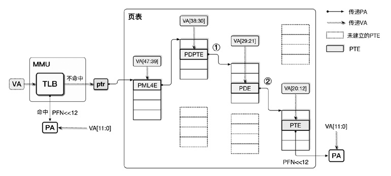

# 内存虚拟化

## 内存虚拟化的实现

由于虚拟化系统中存在多个客户机操作系统，而客户机操作系统使用的客户机虚拟地址需要与真实的物理内存一一对应，因此虚拟化系统中需要有：①客户机虚拟地址（GVA）和客户机物理地址（GPA）的关系；②宿主机虚拟地址（HVA）和宿主机物理地址的对应关系（HPA）。

## 页表
现代操作系统中，虚拟内存和物理内存被分为4KB页，映射表中只记录VFN（Virtual Frame Number，虚拟页号）对应的PFN（Physical Frame Number，物理页号），映射表表项数量减少为原来的1/4096。映射表记录了虚拟页与物理页之间的映射，于是得名PT（Page Table，页表），其表项称为PTE（Page Table Entry，页表项）。

在64位架构（如x86-64、ARMv8-A）中，操作系统使用9+9+9+9形式的四级页表，其中页表（Page Table，PT）的每一级分别用PML4（Page Map Level 4，第4级页映射）、PDPT（Page Directory Pointer Table，页目录指针表）、PD（Page Directory，页目录）、PT表示，查询一次页表需要4次内存访问。

MMU（Memory Management Unit，内存管理单元）负责查询页表，每个CPU核心上都配备了一个独立的MMU，只要CPU将页表的基地址放入一个指定的寄存器中，MMU中的PTW（Page Table Walker，页表爬取器）即可查找页表将CPU产生的VA自动翻译成PFN，左移12位后与VA的低12位相加即得到PA，不需要CPU执行额外的指令。这一指定的寄存器在Intel体系中是CR3，在ARM体系中是TTBRx（Translation Table Base Register x，翻译表基地址寄存器x）。这些架构下的地址翻译原理大致相同，图中统一使用ptr（pointer，指针）代表页表基地址。

缩短地址转换时间的一种重要方式是缓存。在MMU中，TLB（Translation Lookaside Buffer，翻译后备缓冲器）用于缓存VA到PA的映射，避免查询页表造成的内存访问。MMU中也有页表缓存，用于缓存PTE，进一步优化TLB不命中时的性能。

## ARMv8内存虚拟化
在ARM处理器中，VMSA（Virtual Memory System Architecture，虚拟内存系统架构）给在ARMv8处理器的AArch64模式下运行的处理单元（Processing Element，PE）提供了虚拟内存管理功能。具体而言，VMSAv8-64为PE提供了MMU，当PE进行内存访问时，MMU可以完成地址翻译、权限检查以及内存区域类型判断等功能。对于PE而言，它访问内存时使用的是VA，MMU可以：
①将VA映射到PA，用于访问物理内存系统中的资源。完成地址映射时，MMU会使用保存着页表基地址的寄存器；
②如果由于一些原因，无法将VA映射到PA，则会引起异常（Exception），称为MMU异常（MMU Fault）。系统寄存器负责保存引起MMU异常的原因，供软件使用。

M架构中提出了一个通用的概念，即翻译流程（Translation Regime），用来概括物理机环境和虚拟化环境下的内存翻译流程。ARM中包括两类翻译流程：
①单阶段的地址翻译，即VA翻译为PA，是在物理机上运行的操作系统中发生的地址翻译流程；
②两个连续阶段的地址翻译，即客户机虚拟地址翻译为客户机物理地址，进而翻译为宿主机物理地址。
ARM架构为了与前一种翻译流程的说法统一，将客户机虚拟地址依然称为VA，客户机物理地址称为IPA（Intermediate Physical Address，中间物理地址），宿主机物理地址称为PA，阶段-1的地址翻译将VA翻译为IPA（Stage-1），阶段-2的地址翻译将阶段-1得到的IPA作为输入，翻译为PA（Stage-2）。

开启EL2时，运行在EL1的操作系统成为客户机操作系统，于是EL0&EL1异常级上的内存访问共用一个两阶段的翻译流程，即前文所述的VA→IPA→PA。虚拟机应用要想访问物理内存必须经过两级转换：VM维护一套地址转换表，Hypervisor控制最终的转换结果。在第一级转换的过程中，虚拟机将其虚拟地址（VA）转化为虚拟机视角下的物理地址（IPA），然后由Hypervisor最终控制转化为实际的物理内存地址（PA）。

IPA作为中间物理地址的时候，不仅存在内存区，它还包含了外围设备区域。虚拟机可以通过IPA的外围设备区域来访问虚拟机可见设备。而设备又包括两种：直通设备和虚拟的外围设备。当一个直通设备被分配给虚拟机以后，该设备就会被映射到IPA地址空间，然后VM通过IPA直接访问物理设备。而当虚拟机需要使用虚拟的外围设备时，在地址转换的阶段-2，也就是从IPA转换到设备空间的时候会触发错误。当错误被Hypervisor捕获后由Hypervisor对设备进行模拟。

VMSA中支持三种类型的地址：VA、IPA以及PA。在AArch64执行模式下，内存访问的地址VA共64位，但查询页表时，仅使用其中的48位，故虚拟地址空间共48位。由于查询页表仅使用VA中的前48位，剩余的16位可以用于标记属于两个VA地址范围中的哪一个。其中，在内核VA的范围内（Kernel Space），所有VA的高16位均设为1，故内核可以使用的范围是 0xffff000000000000-0xffffffffffffffff；在用户VA的范围内（User Space），所有VA的高16位均设为0，故用户空间可以使用的范围是 0x0000000000000000-0x0000ffffffffffff。
