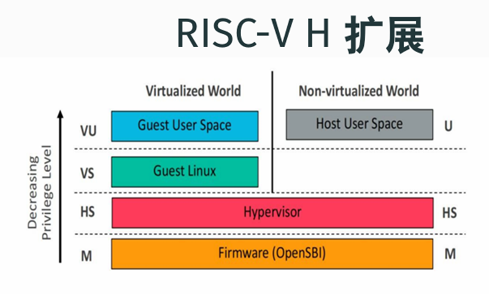
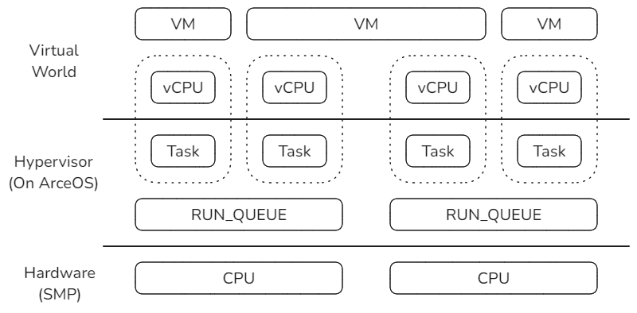
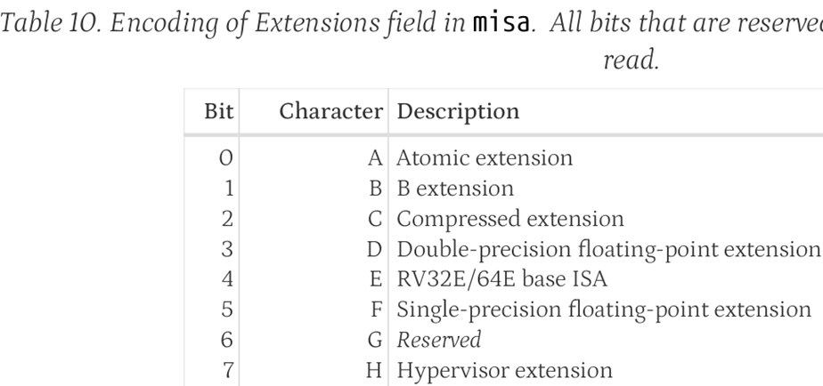
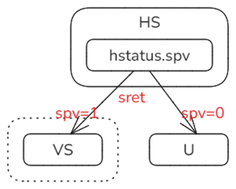
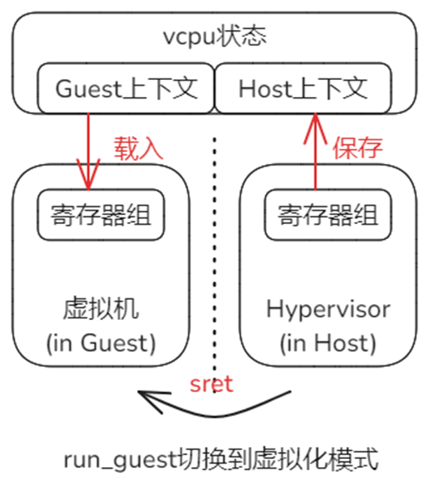
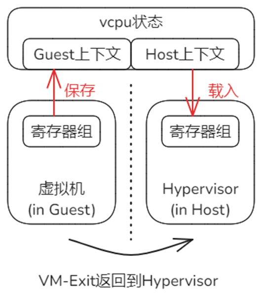

# 概述

本节介绍在RISC-V体系结构中，与**CPU虚拟化**相关的基本知识、原理和设计。

# 体系结构的虚拟化扩展 'H'

与x86等体系架构类似，RISC-V也采取了硬件辅助虚拟化的方式，以提升虚拟化效率，这种方式表现为对体系结构的一个扩展，代号'H'。



<center>图1：RISC-V扩展的官方示意图</center>

上图来自RISC-V官方文档，可以看出，虚拟化扩展'H' 在原有的**非虚拟化世界**基础上创造了一个平行的**虚拟化世界**。

虚拟化世界是一个虚拟的计算机环境，它包含了两个特权级，正好可以满足各类主流的客户操作系统（Guest OS）设计与机制上对特权级保护的需要，其中**VS**用于运行Guest OS的内核，**VU**用于运行Guest OS支撑的用户态应用。只要不触及**敏感指令**，整个Guest OS及其之上的应用都只会在这个虚拟世界中运行，如此就保证了较高的执行效率；只有执行到**敏感指令**，虚拟世界无法提供虚拟化支持时，才会跳回到非虚拟化世界，此时Hypervisor接管系统执行权，处理虚拟世界模式中无法处理的情况后，再返回到虚拟世界中继续运行。

特权级**HS**是让两个世界相互切换机制得以实现的关键，Hypervisor就运行在这个特权级。该特权级在原有**S**特权级的基础上增加了一些特性与机制，针对虚拟化，新增了一些寄存器，扩展了某些寄存器的属性位，例如，在一个特殊的寄存器标志位的控制下，HS特权级可以决定是向**U**还是向**VS**返回。（后面专门说明该寄存器标志位）

下面为'H'扩展的相关概念和机制给出更准确的描述。

* 非虚拟化世界 - 基本模式，或简称H-Mode。（在x86体系结构中，称为根模式）

* 虚拟化世界 - 虚拟模式，或简称V-Mode。（在x86体系结构中，称为非根模式）

按照'H'扩展的设计，模式与特权级之间是**正交**的关系。图1虽然直观，但未能很好的体现这种正交的关系，它应该是受到了**模拟器**层次示意图的影响。但Hypervisor与模拟器还是有明确的区别。下面是更准确的图示：


<center>图2：模式与特权级的正交关系</center>

> 虚拟机是对物理机的“高效”复制，高效主要体现在虚拟机与物理机的“同质性”上，核心是CPU指令集的兼容，让虚拟机需要执行的大多数指令都可以不须翻译过程，而直接运行在物理CPU上。

Guest所在的虚拟机运行在V-Mode模式中，一般的CPU指令直接由物理CPU执行，并不需要Hypervisor这一层次的中介干预，这是主流；只是在触及敏感指令才会切换到H-Mode，由Hypervisor处理。由于触及敏感指令是相对少数的情况，所以上面的正交关系示意图应该是更为合理的表述。

> 本节只是涉及CPU虚拟化，事实上，对于内存和设备虚拟化来说，如果Hypervisor已经完成了特定物理页帧与Guest的分配关联，如果对特定外设采取了Passthrough的方案，那么Guest在运行中同样是直通物理硬件，而不需要Hypervisor作为中介干预的，Hypervisor在此类情况下，只是提前为Guest做了setup的工作。

# CPU虚拟化涉及的关键对象及相互关系

在CPU虚拟化方面涉及的关键对象主要包括vCPU、虚拟机VM、物理CPU、任务Task和运行队列RUN_QUEUE，其中任务Task与运行队列由ArceOS提供，Hypervisor基于对它们的扩展和使用来实现所需的功能，它们的关系如下：



以vCPU为起点进行分析，它是虚拟化世界中逻辑执行的主体。

每个虚拟机VM至少有一个vCPU，称为Primary vCPU，也是Boot vCPU。在此基础上，虚拟机VM可以包含更多的Secondary vCPU。这些从属于同一个虚拟机的vCPU在执行上是相互独立的，它们可以在不同的物理CPU上被同时调度执行。

vCPU实现的基础是ArceOS中的Task，它们可以看作是同一个对象在不同层面各自的表现形式，即在虚拟世界中表现为vCPU，而在ArceOS Hypervisor中的运行形式就是Task。

每个物理CPU有自己的RUN_QUEUE，如果想指定vCPU在某个或某组物理CPU上执行，只要把vCPU对应Task调度到相应的RUN_QUEUE即可。

# 虚拟机首次启动前的准备

虚拟机VM首次启动前，Hypervisor需要为其检查和准备必要的条件。与CPU相关的核心工作：

* 检查确认硬件平台支持‘H'扩展

  底层平台必须支持RISC-V的’H'扩展，首先OpenSBI固件在启动时会检查misa寄存器的第7个状态位，如果是1表示支持虚拟化扩展。

  

  Hypervisor可以通过查看OpenSBI的输出来确定是否支持。但目前Hypervisor采取的方式是：直接尝试读hgatp，如果读失败，则说明底层平台不支持‘H’扩展。

  > OpenSBI可以通过把misa的第7位设置为0，来从固件层面关闭对虚拟化的支持。

* 设置寄存器hstatus状态，为切换到虚拟化模式做准备

  特权级HS是U特权级切换和VS特权级切换的汇聚点，执行sret进行特权级返回时，通过hstatus的SPV这一位来确定返回的方向。

  SPV这一位的作用是保存进入HS特权级之前的原始模式，如果是0，表示之前是非虚拟化模式，即从U特权级切换而来；如果是1，表示之前是在虚拟化模式中运行，即从VS特权级切换而来。

  

  Hypervisor在首次进入虚拟机之前，把hstatus的SPV设置为1，这样将来在执行sret时就能够确保进入到虚拟机中运行。

* 设置Guest寄存器sepc和sstatus，指定Guest OS 内核最初启动的指令地址和状态

  预先为Guest伪造现场，当虚拟器首次启动时，将从Guest OS内核的入口开始执行。
  
  


准备工作完成后，Hypervisor通过VM-Entry过程首次启动虚拟机（实际是启动Primary vCPU），由此进入一个循环：


虚拟机启动后，Guest OS的内核与用户态应用在虚拟环境中运行，如同在物理机器中运行；触及敏感指令时将触发VM-Exit过程，退出虚拟化模式，控制权返回到Hypervisor，Hypervisor根据退出原因进行相应的处理，然后再次经由VM-Entry过程进入虚拟机，Guest将从上次执行的断点处恢复执行，如同从未被打断执行一样。如此循环往复，直至虚拟机关闭。

# VM-Entry: 从Host到Guest

VM-Entry是从Host环境进入Guest环境的过程，在体系结构的层面看，物理CPU需要完成从非虚拟化模式到虚拟化模式的切换。在切换过程中，一些跨模式共享的寄存器就可能遭到破坏。因此，Hypervisor需要在物理层执行切换前，预先保存部分寄存器组的状态到Host上下文中。此外，物理层面的模式切换完成后，会立即基于当时的寄存器状态继续工作，因此还需要在模式切换前，从Guest上下文中恢复相关寄存器到上次离开Guest环境到状态。vCPU代表了虚拟环境中独立的执行流，因此Host和Guest上下文同一由vCPU来维护。



具体到RISC-V体系结构，对于VM-Entry，保存/恢复上下文的工作在\_run_guest中完成，最后执行sret指令完成物理CPU的模式切换。过程\_run_guest定义在riscv_vcpu/src/trap.S文件中，关键的数据结构和过程如下：

* RISCV_VCPU保存寄存器上下文的结构，参见riscv_cpu/src/vcpu.rs和riscv_cpu/src/regs.rs

  ```rust
  pub struct RISCVVCpu<H: AxVCpuHal> {
      regs: VmCpuRegisters,
  	... ...
  }
  
  pub struct VmCpuRegisters {
      // CPU state that's shared between our's and the guest's execution environment. Saved/restored
      // when entering/exiting a VM.
      pub hyp_regs: HypervisorCpuState,
      pub guest_regs: GuestCpuState,
  	... ...
  ```

  每个RISCV_VCPU实例中通过regs成员保存寄存器状态，具体又分为Host上下文hyp_regs和Guest上下文guest_regs。

* 向\_run_guest传入上下文数据区的起始地址，参见riscv_vcpu/src/vcpu.rs

  RISCV_VCPU的主运行方法run在调用\_run_guest时，会传入其regs成员的地址作为参数。

  ```rust
  fn run(&mut self) -> AxResult<AxVCpuExitReason> {
  	... ...
      // Safe to run the guest as it only touches memory assigned to it by being owned
      // by its page table
      _run_guest(&mut self.regs);
  	... ...
  ```

  RISCV_VCPU成员regs的地址作为第一个参数，在汇编层面保存在a0寄存器中。

* 过程\_run_guest关于保存Host上下文的实现，参见riscv_vcpu/src/trap.S

  接上面，\_run_guest中的a0保存的是RISCV_VCPU的成员regs的开始地址，加上偏移就可以访问到Host/Guest两组上下文中存放各个寄存器的具体位置。

  ```assembly
  _run_guest:
      /* Save hypervisor state */
  
      /* Save hypervisor GPRs (except T0-T6 and a0, which is GuestInfo and stashed in sscratch) */
      sd   ra, ({hyp_ra})(a0)
      sd   gp, ({hyp_gp})(a0)
      sd   tp, ({hyp_tp})(a0)
  	... ...
  ```

* 过程\_run_guest关于恢复Guest上下文的实现

  ```rust
      /* Restore the gprs from this GuestInfo */
      ld   ra, ({guest_ra})(a0)
      ld   gp, ({guest_gp})(a0)
      ld   tp, ({guest_tp})(a0)
  	... ...
  ```

  为Guest运行提前准备，把涉及的寄存器状态从上下文中恢复出来。

* 执行模式切换，进入到虚拟机执行Guest OS

  在前面已经保存和恢复上下文的基础上，通过指令`sret`完成物理CPU模式的切换，进入到Guest环境中执行。

# VM-Exit：从Gust返回Host

VM-Exit是虚拟机无法满足虚拟化条件时，从体系结构硬件发起的、由特殊trap响应函数配合的自动过程。从执行逻辑上看，它基本上是GuestVM-Entry的逆向过程。



* VM-Exit过程的触发

  VM-Exit过程的触发是物理硬件的基本机制，相当于宏内核模式下，低特权级程序在执行某些特权操作时所触发的trap过程。软件层面Hypervisor需要做的工作就是在上次执行\_run_guest时，提前注册响应函数\_guest_exit。

  ```assembly
      /* Set stvec so that hypervisor resumes after the sret when the guest exits. */
      la    t1, _guest_exit
      csrrw t1, stvec, t1
  	...
  ```

  对于RISC-V，寄存器stvec保存trap响应函数入口表的起始地址，对于虚拟化导致的trap同样适用。

* VM-Exit的响应过程

  响应过程主体就是\_guest_exit的实现，参见riscv_vcpu/src/trap.S

  ```assembly
  .align 2
  _guest_exit:
      /* Pull GuestInfo out of sscratch, swapping with guest's a0 */
      csrrw a0, sscratch, a0
  
      /* Save guest GPRs. */
      sd   ra, ({guest_ra})(a0)
      sd   gp, ({guest_gp})(a0)
      sd   tp, ({guest_tp})(a0)
  	... ...
  	ret
  ```

  由于逻辑上基本是\_run_guest的逆过程，不再赘述。但是需要特别注意该过程的最后一行是`ret`指令，是普通的函数返回指令，原理是从寄存器ra取出返回地址后跳转。回顾VM-Entry中切换模式进入虚拟机时，执行的是\_run_guest，如下：

  ```rust
  fn run(&mut self) -> AxResult<AxVCpuExitReason> {
  	... ...
      // Safe to run the guest as it only touches memory assigned to it by being owned
      // by its page table
      _run_guest(&mut self.regs);
  	... ...	// <- Reg 'ra' points to this line.
  ```

  当时寄存器ra保存的就是\_run_guest函数的下一行指令代码地址，所以此时执行`ret`的效果就是返回到该处继续执行。

  从Hypervisor的角度看，它执行\_run_guest的效果就如同执行了一次普通的函数调用，但是内部已经经历了一次从进入虚拟机到退出虚拟机的完整周期。

# 附1：参考资料

RISC-V官方指令手册中，关于‘H’扩展的章节。

[riscv-docs/riscv-privileged-20211203.pdf at main · konpoe/riscv-docs](https://github.com/konpoe/riscv-docs/blob/main/riscv-privileged-20211203.pdf)

# 附2：vCPU与物理CPU绑定

如正文所述，Hypervisor基于对ArceOS的扩展实现。vCPU与ArceOS的Task是一体的，因此vCPU与物理CPU的绑定关系是通过Task与物理CPU的绑定关系来实现的。

ArceOS提供了要给cpumask的功能，即通过位图的形式指定Task可以被哪些RUN_QUEUE所执行，RUN_QUEUE与物理CPU是一一对应的关系，由此可以实现vCPU到物理CPU的绑定。